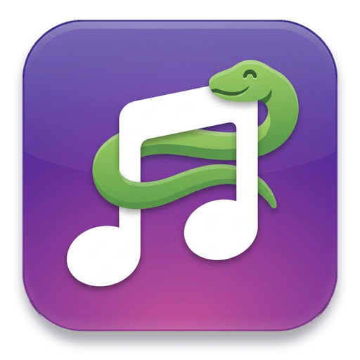
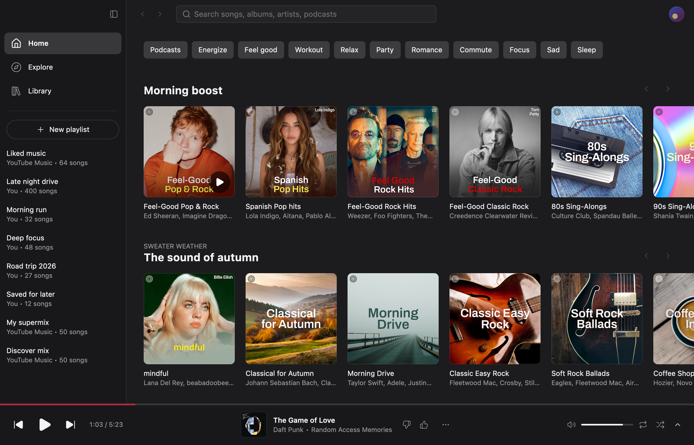
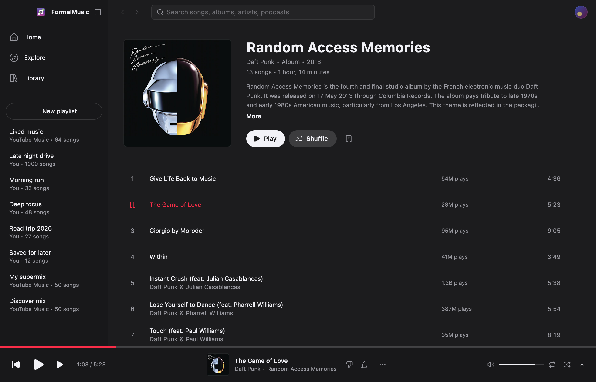
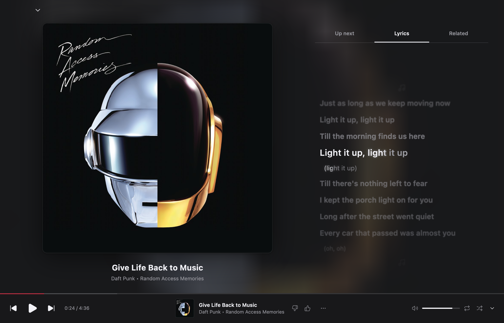
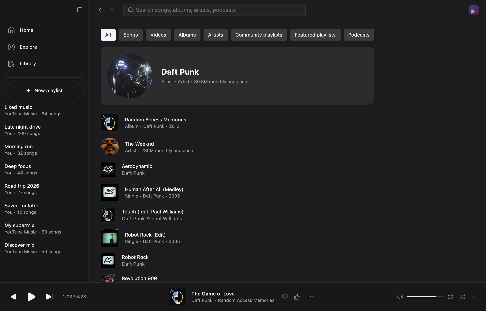
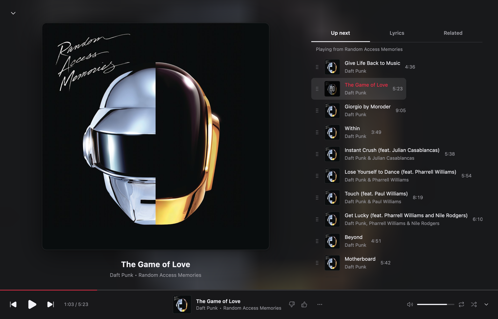

<p align="center"></p>

# FormalMusic

YouTube Music on Linux. A native Rust client (GPUI) on top of its own playback
daemon, with synced lyrics and Apple Music motion artwork.



```
┌──────────────────────┐  JSON lines   ┌────────────────────────────────┐
│ formalmusic (GPUI)   │ ────────────▶ │ formalmusicd                   │
│ window, Vulkan       │ ◀──────────── │ InnerTube client, yt-dlp,      │
└──────────────────────┘  unix socket  │ audio engine, queue, MPRIS     │
                                       └────────────────────────────────┘
```

The daemon owns playback, so music keeps going with the window closed and media
keys work through MPRIS. The window paints from its last state before the
daemon answers, pages you have seen open in the frame you click, and it idles
at 0% CPU.

| | |
|---|---|
|  |  |
|  |  |

## Features

- Home with mood chips, Explore (new releases, charts, moods and genres),
  search with suggestions and filters, album, artist, playlist and podcast pages.
- Library: playlists, songs, albums, artists, subscriptions, podcasts, uploads,
  liked music and history. Likes, subscriptions and playlist editing.
- Queue with drag to reorder, play next, radio that keeps itself topped up,
  shuffle and repeat. Gapless playback, optional crossfade, loudness
  normalisation from YouTube's own values.
- Premium streams (Opus up to 256 kbps) when the account has Premium.
- Word-synced lyrics from Apple Music, LRCLIB or YouTube Music, whichever has
  the best timing, drawn in the Apple Music style.
- Apple Music motion artwork for albums that have it.
- Brand accounts, and plays reported to YouTube so History and recommendations
  stay current.
- Colours follow [matugen](https://github.com/InioX/matugen) live.

Video playback and comments are not there yet.

## Install

### Nix

```
nix run github:FormalSnake/formalmusic
```

Home Manager:

```nix
{
  inputs.formalmusic = {
    url = "github:FormalSnake/formalmusic";
    inputs.nixpkgs.follows = "nixpkgs";
  };

  # in your home-manager configuration
  imports = [ inputs.formalmusic.homeModules.default ];

  programs.formalmusic = {
    enable = true;
    daemon = true;                     # formalmusicd as a systemd user service
    theme = { accent = "#6099c0"; };   # optional, writes theme.json
  };
}
```

This installs the app, the daemon, the desktop entry and icon. The package
pins its own yt-dlp release rather than nixpkgs' copy, which trails YouTube's
changes by days. `overlays.default` adds `pkgs.formalmusic`.

### Other Linux

Needs a recent stable Rust, Vulkan, `yt-dlp` and `ffmpeg` on `PATH`, a `python3` that
can `import yt_dlp` (or `FORMALMUSIC_YTDLP_PYTHON` naming one), and `libxkbcommon`,
`wayland`, `vulkan-loader`, `fontconfig`, `freetype`, `alsa-lib`, `libopus`.

```
git clone https://github.com/FormalSnake/formalmusic
cd formalmusic
cargo build --release -p formalmusic -p formalmusicd
```

Put both binaries on `PATH`. The app starts the daemon itself when no service
is running.

## Signing in

On first launch, pick a browser profile that is already signed in to YouTube
Music and the daemon copies its session with yt-dlp, which works while the
browser is open. Otherwise it opens your browser in a throwaway profile at
Google's sign-in page and keeps the cookies once you are in. Pasting the
`Cookie` request header of a signed-in music.youtube.com tab still works as a
last resort. The daemon keeps the session in
`$XDG_STATE_HOME/formalmusic/session.json` (mode 0600). Without signing in,
everything that doesn't need an account works.

`FORMALMUSIC_DEMO=1 formalmusic` runs on recorded responses with no daemon.

## Scrobbling

Settings (`Ctrl+,`, or the account menu) connects Last.fm and ListenBrainz.
Each play goes out as now playing when it starts and again on resume, and
counts once it has played for half its length or four minutes, whichever
comes first (tracks of 30 seconds or less never count). Videos are reported
with cleaned titles and the album of the matching album track. Plays wait in
`$XDG_STATE_HOME/formalmusic/scrobble-queue.json` while offline and go out in
batches later.

Last.fm signs every call with an API account, so you need your own: create
one at [last.fm/api/account/create](https://www.last.fm/api/account/create)
(no callback URL), paste its API key and shared secret into Settings, then
allow access in the browser. With Home Manager the pair can come from files
instead, such as agenix secrets:

```nix
programs.formalmusic.lastfm = {
  apiKeyFile = "/run/agenix/lastfm-api-key";
  sharedSecretFile = "/run/agenix/lastfm-shared-secret";
};
```

ListenBrainz connects from a browser profile signed in to listenbrainz.org,
or from the user token on
[listenbrainz.org/settings](https://listenbrainz.org/settings/). Session
keys, tokens and a pasted API account stay in
`$XDG_STATE_HOME/formalmusic/scrobble.json` (mode 0600).

## Configuration

`~/.config/formalmusic/daemon.json` (the daemon never writes it):

```json
{ "reportHistory": true, "normalisation": true, "crossfadeMs": 0 }
```

`~/.config/formalmusic/theme.json` overrides palette tokens (fields of
`PaletteFile` in `crates/desktop/src/live_theme.rs`) and is reloaded live, so
matugen can drive it:

```json
{ "canvas": "#1c1917", "text": "#b4bdc3", "accent": "#6099c0" }
```

Environment overrides: `FORMALMUSIC_SOCKET`, `FORMALMUSIC_YTDLP`,
`FORMALMUSIC_FONT`, `FORMALMUSIC_TRACE=1` (startup and navigation timings).

The daemon speaks JSON lines on `$XDG_RUNTIME_DIR/formalmusic/formalmusicd.sock`,
so a bar widget can drive it:

```
echo '{"id":1,"cmd":"toggle"}' | socat - UNIX-CONNECT:$XDG_RUNTIME_DIR/formalmusic/formalmusicd.sock
```

## Keyboard

| | |
|---|---|
| `Space` / `;` | play or pause |
| `J` / `K`, `Shift+N` / `Shift+P`, `N` / `P` | next / previous |
| `H` / `L`, `Shift+←` / `Shift+→` | back / forward 10 seconds |
| `Shift+H` / `Shift+L` | back / forward 1 second |
| `=` / `-`, `Shift+↑` / `Shift+↓` | volume |
| `M` | mute |
| `+` / `_` | like / dislike |
| `S` / `R` | shuffle / repeat |
| `G H`, `G E`, `G L`, `G ,` | Home, Explore, Library, Settings |
| `/`, `Ctrl+F` | search |
| `Q` | queue |
| `F` | expanded player |
| `?` | all shortcuts |
| `Alt+←` / `Alt+→` | back / forward |
| `Ctrl+,` | settings |

`Cmd` on macOS.

## Development

```
nix develop
FORMALMUSIC_DEMO=1 cargo run --release -p formalmusic   # recorded responses
cargo test --workspace
cargo test -p formalmusic-innertube -- --ignored        # live checks against YouTube
nix build .#formalmusic                                 # Linux package
```

`maintenance/live-check.sh` runs the live checks against an isolated daemon
of the checkout: it plays 10 seconds of a fixed track into a null sink,
fetches Home, Search and an album over the socket, runs the live innertube
tests and diffs the renderer keys YouTube sends against the fixtures. A
weekly systemd timer on the maintainer's machine runs Claude Code headless
with `maintenance/weekly.md` as the prompt: it bumps yt-dlp, nixpkgs and the
crates, runs the checks, repairs what broke and ships the result as a PR.

`crates/api` is the socket contract, `crates/innertube` the YouTube Music
client, `crates/player` the audio engine, `crates/extras` lyrics and motion
artwork, `crates/daemon` ties them together, `crates/core` is the window's
store and `crates/desktop` the window. `PLAN.md` has the architecture and the
speed budget.

## License

[MIT](LICENSE). The fonts in `packaging/fonts` are under the
[OFL](packaging/fonts/OFL.txt). Not affiliated with YouTube, Google or Apple.
